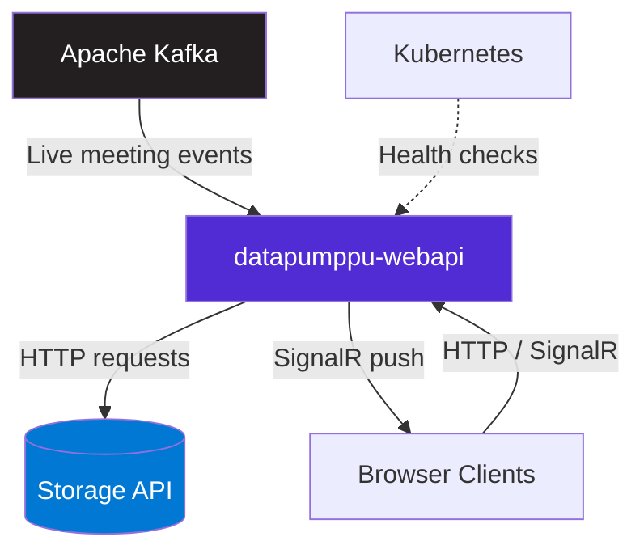
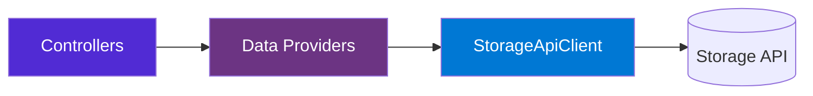
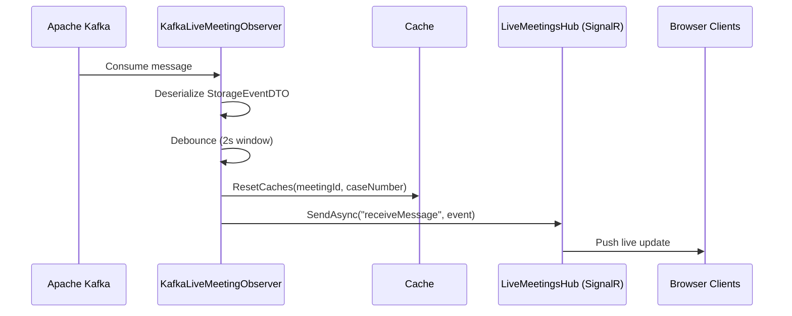
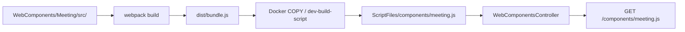

# datapumppu-webapi


A public-facing ASP.NET Core Web API microservice in the Datapumppu ecosystem that serves Helsinki city council meeting data to browser clients and provides real-time live meeting updates via SignalR.

## Table of Contents

- [datapumppu-webapi](#datapumppu-webapi)
  - [Table of Contents](#table-of-contents)
  - [About](#about)
  - [Key Features](#key-features)
  - [Architecture](#architecture)
    - [System Context](#system-context)
    - [Internal Architecture](#internal-architecture)
    - [Event-Driven Architecture](#event-driven-architecture)
  - [Built With](#built-with)
  - [Prerequisites](#prerequisites)
  - [Getting Started](#getting-started)
    - [Installation](#installation)
    - [Configuration](#configuration)
    - [Running Locally](#running-locally)
    - [Docker Setup](#docker-setup)
  - [API Documentation](#api-documentation)
    - [API Overview](#api-overview)
    - [Key Endpoints](#key-endpoints)
  - [Deployment](#deployment)
    - [Dev/test environment](#devtest-environment)
    - [Staging/Production environment](#stagingproduction-environment)
    - [CI/CD Pipeline](#cicd-pipeline)
    - [Health Monitoring](#health-monitoring)
  - [Development](#development)
    - [Project Structure](#project-structure)
    - [Web Component Development](#web-component-development)
    - [Code Documentation](#code-documentation)
    - [Testing](#testing)

## About

The **datapumppu-webapi** is a .NET 6.0 ASP.NET Core microservice that acts as the public API gateway for the Datapumppu ecosystem. It does not own a database; instead, it proxies all data requests to an external Storage API and caches responses in memory with configurable time-to-live durations.

This service handles:
- **Meeting data retrieval** -- Fetches and caches meeting, voting, statement, seat, and reservation data from the Storage API
- **Real-time live meeting broadcasts** -- Consumes Kafka events and pushes live updates to connected browser clients via SignalR
- **Editor operations** -- Provides JWT-authenticated endpoints for editing agenda points and video synchronization
- **Statistics export** -- Serves cached statistics data as JSON and CSV downloads for participants, statements, and voting records
- **Web component serving** -- Dynamically configures and serves a JavaScript web component for meeting display
- **Translations** -- Serves UI translation files in Finnish, Swedish, and English

## Key Features

- **In-memory caching with configurable TTL** -- 5-minute cache for meeting data, 1-hour cache for person statements, 1-day cache for statistics
- **Real-time event streaming** -- Kafka consumer with 2-second debounce window broadcasts live meeting events via SignalR
- **JWT authentication** -- HS256-based authentication for protected editor endpoints
- **Automatic cache invalidation** -- Live Kafka events reset relevant caches while preserving meeting data
- **Multi-language support** -- Translation files for Finnish (fi), Swedish (sv), and English (en)
- **Health checks** -- Liveness and readiness probes for Kubernetes orchestration

## Architecture

### System Context

The datapumppu-webapi is one microservice within the larger **Datapumppu ecosystem**. It integrates with external systems as shown below:



### Internal Architecture

The datapumppu-webapi follows a **layered proxy-cache** pattern:



**Layer Responsibilities:**

- **Controllers** (`WebAPI/Controllers/`) -- Handle HTTP requests, validate input, and return formatted responses (JSON, CSV, JavaScript)
- **Data Providers** (`WebAPI/Data/`) -- Thread-safe in-memory caching layer using `SemaphoreSlim`; each provider caches data from the Storage API with a specific TTL
- **StorageApiClient** (`WebAPI/StorageClient/`) -- HTTP client that communicates with the external Storage API for all data operations

### Event-Driven Architecture

Live meeting events flow through the system as follows:



## Built With

| Technology | Version | Purpose |
|------------|---------|---------|
| [.NET](https://dotnet.microsoft.com/) | 6.0 | Application framework |
| [ASP.NET Core](https://learn.microsoft.com/aspnet/core/) | 6.0 | Web API and middleware |
| [Confluent.Kafka](https://github.com/confluentinc/confluent-kafka-dotnet) | 2.8.0 | Kafka consumer for live events |
| [SignalR](https://learn.microsoft.com/aspnet/core/signalr/) | 6.0 | Real-time client communication |
| [Newtonsoft.Json](https://www.newtonsoft.com/json) | 13.0.3 | JSON serialization |
| [React](https://react.dev/) | 18 | Meeting web component UI |
| [Node.js](https://nodejs.org/) | 16 | Web component build tooling (Webpack 5) |

## Prerequisites

Before you begin, ensure you have the following installed:

- **[.NET 6.0 SDK](https://dotnet.microsoft.com/download/dotnet/6.0)** -- Required to build and run the application
- **[Docker](https://www.docker.com/)** -- Required for containerized builds (includes Node.js 16 for web component compilation)
- **[Node.js 16](https://nodejs.org/)** -- Only needed if building web components outside Docker

**Recommended IDEs:**
- Visual Studio 2022
- Visual Studio Code with the C# extension

## Getting Started

### Installation

1. **Clone the repository:**
   ```bash
   git clone <repository-url>
   cd datapumppu-webapi
   ```

2. **Restore dependencies:**
   ```bash
   dotnet restore WebAPI.sln
   ```

### Configuration

Configure the application using environment variables or `appsettings.Development.json`:

| Variable | Description | Example |
|----------|-------------|---------|
| `STORAGE_URL` | Base URL of the external Storage API | `http://localhost:5154` |
| `API_URL` | Public base URL of this WebAPI service | `http://localhost:5212` |
| `JWT_KEY` | Symmetric key for JWT token signing (HS256) | `<JWT_KEY>` |
| `JWT_ISSUER` | JWT token issuer claim | `http://localhost:5212/` |
| `JWT_AUDIENCE` | JWT token audience claim | `http://localhost:5212/` |
| `ALLOWED_HOSTS` | Comma-separated list of allowed CORS origins | `http://localhost:3000` |
| `KAFKA_BOOTSTRAP_SERVER` | Kafka broker address | `localhost:9092` |
| `KAFKA_CONSUMER_TOPIC` | Kafka topic for live meeting events | `webapi-topic` |
| `KAFKA_USER_USERNAME` | Kafka SASL username (production only) | *(set in secrets)* |
| `KAFKA_USER_PASSWORD` | Kafka SASL password (production only) | *(set in secrets)* |
| `SSL_CERT_PEM` | PEM certificate for Kafka SSL (production only) | *(set in secrets)* |

**Example `appsettings.Development.json`:**
```json
{
  "Logging": {
    "LogLevel": {
      "Default": "Information",
      "Microsoft.AspNetCore": "Warning"
    }
  },
  "API_URL": "http://localhost:5212",
  "STORAGE_URL": "http://localhost:5154",
  "JWT_KEY": "<JWT_KEY>",
  "JWT_ISSUER": "http://localhost:5212/",
  "JWT_AUDIENCE": "http://localhost:5212/",
  "KAFKA_BOOTSTRAP_SERVER": "localhost:9092",
  "KAFKA_CONSUMER_TOPIC": "webapi-topic"
}
```

### Running Locally

1. **Ensure the Storage API is running** at the URL specified in `STORAGE_URL`.

2. **Build and run the application:**
   ```bash
   dotnet build WebAPI.sln
   dotnet run --project WebAPI
   ```

The application will start on `http://localhost:8080` by default (configurable via `ASPNETCORE_URLS`).

**Verify the application is running:**
```bash
curl http://localhost:8080/healthz
# Expected: Healthy
```

> **Note:** The web component (`meeting.js`) is only available when built via Docker or by running `npm install && npm run build` in `WebAPI/WebComponents/Meeting/` and copying the output to `WebAPI/ScriptFiles/components/`.

### Docker Setup

**Build Docker image:**
```bash
docker build -t datapumppu-webapi:latest .
```

**Run container:**
```bash
docker run -d \
  --name datapumppu-webapi \
  -p 8080:8080 \
  -e STORAGE_URL="http://host.docker.internal:5154" \
  -e API_URL="http://localhost:8080" \
  -e JWT_KEY="your-secret-key" \
  -e JWT_ISSUER="http://localhost:8080/" \
  -e JWT_AUDIENCE="http://localhost:8080/" \
  -e ALLOWED_HOSTS="http://localhost:3000" \
  -e KAFKA_BOOTSTRAP_SERVER="host.docker.internal:9092" \
  -e KAFKA_CONSUMER_TOPIC="webapi-topic" \
  datapumppu-webapi:latest
```

> **Tip:** Use `host.docker.internal` to access services running on the host machine from within the Docker container.

## API Documentation

### API Overview

The datapumppu-webapi provides RESTful APIs organized by the following controllers:

| Controller | Purpose | Example Endpoints |
|------------|---------|-------------------|
| **MeetingController** | Meeting data retrieval | `GET /meetings/meeting` |
| **VotesController** | Voting records | `GET /voting/{meetingId}/{caseNumber}` |
| **StatementController** | Statement records | `GET /statement/{meetingId}/{caseNumber}` |
| **SeatsController** | Seating information | `GET /seats/{meetingId}/{caseNumber}` |
| **ReservationsController** | Reservation data | `GET /reservations/{meetingId}/{caseNumber}` |
| **AgendaPointSubItemsController** | Agenda sub-items | `GET /agendapoint/{meetingId}/{agendaPoint}` |
| **TranslationsController** | UI translations (fi/sv/en) | `GET /api/translations?lang=fi` |
| **EditorController** | JWT login and editing | `POST /editor/login` |
| **WebComponentsController** | Meeting web component | `GET /components/meeting.js` |
| **StatementsAPIController** | External statement queries | `GET /api/statements` |
| **ParticipantStatisticsController** | Participant statistics (JSON) | `GET /statistics/participants/{year}` |
| **PersonStatementStatisticsController** | Person statement stats (CSV) | `GET /statistics/personstatements/{year}` |
| **StatementStatisticsController** | Statement statistics (CSV) | `GET /statistics/statements/{year}` |
| **VotingStatisticsController** | Voting statistics (CSV) | `GET /statistics/votings/{year}` |

### Key Endpoints

| Method | Endpoint | Description |
|--------|----------|-------------|
| GET | `/healthz` | Liveness probe |
| GET | `/readiness` | Readiness probe |
| GET | `/live` | SignalR hub for live meeting events |
| GET | `/meetings/meeting?year={year}&sequenceNumber={seq}&lang={lang}` | Get meeting data |
| GET | `/voting/{meetingId}/{caseNumber}` | Get voting records for a case |
| GET | `/statement/{meetingId}/{caseNumber}` | Get statements for a case |
| GET | `/seats/{meetingId}/{caseNumber}` | Get seating layout |
| GET | `/reservations/{meetingId}/{caseNumber}` | Get reservations |
| GET | `/agendapoint/{meetingId}/{agendaPoint}` | Get agenda sub-items |
| GET | `/api/translations?lang={lang}` | Get UI translations |
| POST | `/editor/login` | Authenticate editor user |
| POST | `/editor/edit` | Update agenda point (JWT required) |
| POST | `/editor/videosync` | Update video sync position (JWT required) |
| POST | `/editor/logout` | Log out editor session |
| GET | `/components/meeting.js` | Get meeting web component |
| GET | `/api/statements?name={name}&year={year}&lang={lang}` | Query person statements |
| GET | `/api/statements/lookup?name={name}&startDate={date}&endDate={date}&lang={lang}` | Lookup statements by criteria |
| GET | `/statistics/participants/{year}` | Participant attendance statistics (JSON) |
| GET | `/statistics/personstatements/{year}` | Per-person statement statistics (CSV) |
| GET | `/statistics/statements/{year}` | Per-issue statement statistics (CSV) |
| GET | `/statistics/votings/{year}` | Voting statistics (CSV) |

**Example Request:**
```bash
# Get meeting data for the first meeting of 2024 in Finnish
curl "http://localhost:8080/meetings/meeting?year=2024&sequenceNumber=1&lang=fi"
```

## Deployment

### Dev/test environment

Open a PR and target the **develop** branch. Once the branch gets merged, Azure pipelines will take care of deployment.

### Staging/Production environment

Open a PR from **develop** and target the **master** branch. Once the branch gets merged, Azure pipelines will take care of deployment.

### CI/CD Pipeline

The project uses **Azure Pipelines** for continuous integration and deployment:

- **Development Branch:** [azure-pipelines-build-develop.yml](azure-pipelines-build-develop.yml) -- Triggers on `develop` branch, runs on Default pool
- **Production Branch:** [azure-pipelines-build-master.yml](azure-pipelines-build-master.yml) -- Triggers on `master` branch

Both pipelines extend templates from the `datapumppu-pipelines` Azure DevOps repository.

### Health Monitoring

The application exposes health check endpoints for Kubernetes probes:

| Endpoint | Type | Use Case |
|----------|------|----------|
| `/healthz` | Liveness | Restarts unhealthy pods |
| `/readiness` | Readiness | Routes traffic only when ready |

**Kubernetes Health Check Configuration (from deployment manifest):**
```yaml
readinessProbe:
  httpGet:
    path: /api/health
    port: 80
  periodSeconds: 3
  timeoutSeconds: 1
```

## Development

### Project Structure

```
datapumppu-webapi/
  WebAPI/
    Controllers/              # HTTP request handlers
      DTOs/                   # Request/response data transfer objects
      ExternalAPI/            # External-facing API controllers
      Filters/                # Exception handling filters
      Statistics/             # Statistics export controllers
    Data/                     # Cached data providers (proxy to Storage API)
      Statistics/             # Statistics data providers with 1-day cache
    LiveMeetings/             # Kafka consumer and SignalR hub
    StorageClient/            # HTTP client for external Storage API
      DTOs/                   # Storage API response models
    Resources/                # Translation files (fi, sv, en)
    ScriptFiles/
      components/
        meeting.js            # Built bundle, served at /components/meeting.js
    WebComponents/
      Meeting/                # React 18 web component source
        src/                  # Component source files
        test-page/            # Local development HTML test page
        dist/                 # Webpack build output (not committed)
        webpack.config.js     # Webpack 5 configuration
        package.json          # npm dependencies
    Properties/               # Launch profiles and publish settings
    Program.cs                # Application entry point and DI configuration
    WebAPI.csproj              # Project file
  k8s/                        # Kubernetes manifests (ConfigMap, Secret, Deployment, Ingress)
  Dockerfile                  # Multi-stage container build (.NET 6 + Node 16)
  WebAPI.sln                  # Solution file
```

### Web Component Development

The `WebAPI/WebComponents/Meeting/` directory contains a **React 18** single-page application bundled with Webpack 5. It is served as a single JavaScript file (`meeting.js`) that consumers embed in their pages to display a fully interactive meeting view.

> **Production usage:** The built `meeting.js` is injected directly into the Helsinki-kanava. The host page adds a `<script>` tag pointing to this endpoint and a `<div id="meeting">` placeholder; the component then renders the full agenda list -- including agenda items, statements, voting results, and seat maps -- inline on that page. Changes to anything under `WebComponents/Meeting/src/` will therefore affect the live production website once the image is rebuilt and deployed.

**Source files (`src/`):**

| File | Purpose |
|------|---------|
| `index.js` | Entry point -- mounts the `Meeting` component into `<div id="meeting">` |
| `Meeting.js` | Root component -- fetches meeting data and connects to the SignalR hub for live updates |
| `AgendaItem.js` | Renders expandable agenda items with sub-items |
| `EditableItem.js` | Editable agenda item (visible to logged-in editors) |
| `Header.js` | Meeting header bar |
| `SeatMap.js` / `SeatRow.js` | Council seat map visualization |
| `Statements.js` | Statement display |
| `Voting.js` | Voting results display |
| `SyncBar.js` | Video synchronization bar for editors |
| `Login.js` | Editor login form |
| `i18n.js` | i18next configuration -- loads translations from the `/api/translations` endpoint |
| `video.js` / `styles.js` | Video utilities and inline styles |

**Placeholder injection:**

The source files contain template placeholders that are filled in at request time by `WebComponentsController`:

| Placeholder | Replaced with |
|-------------|---------------|
| `#--API_URL--#` | Value of the `API_URL` environment variable |
| `#--MEETING_YEAR--#` | `year` query parameter from the request |
| `#--MEETING_SEQUENCE_NUM--#` | `sequenceNumber` query parameter from the request |
| `#--LANGUAGE--#` | `lang` query parameter from the request (`fi`, `sv`, or `en`) |

Consumers load the component with all parameters in the URL:
```html
<script src="/components/meeting.js?year=2024&sequenceNumber=1&lang=fi"></script>
<div id="meeting"></div>
```

**Build flow:**



**Developing the web component locally:**

```bash
cd WebAPI/WebComponents/Meeting
npm install

# Start the Webpack dev server on http://localhost:3000
npm run serve

# Build and copy directly to ScriptFiles/ (cross-platform)
npm run dev-build        # Linux/macOS
npm run windows-build    # Windows
```

The `test-page/test-page.html` file provides a minimal HTML page for loading the component directly from a running WebAPI instance during local development.

### Code Documentation

All public types and methods include **XML documentation comments** following C# standards:

```csharp
/// <summary>
/// Retrieves meeting data for the specified year and sequence number.
/// </summary>
/// <param name="year">The year of the meeting.</param>
/// <param name="sequenceNumber">The sequence number of the meeting within the year.</param>
/// <param name="lang">The language code for localization (fi, sv, en).</param>
/// <returns>The meeting data as JSON, or a 404 response if not found.</returns>
[HttpGet("meeting")]
public async Task<IActionResult> GetMeeting(string year, string sequenceNumber, string lang)
```

Documentation is automatically generated when building with `<GenerateDocumentationFile>true</GenerateDocumentationFile>`.

### Testing

The project does not currently include a unit test project. To build and verify the solution:

```bash
# Build the solution
dotnet build WebAPI.sln
```

---

**Last Updated:** 20.03.2026
